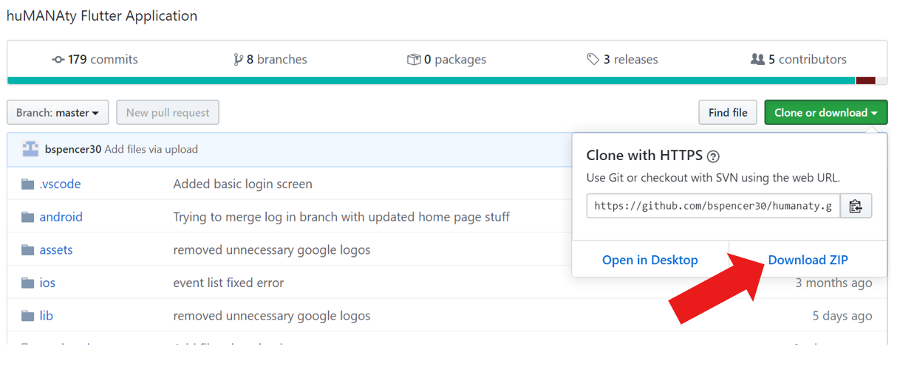

# huMANAty

## Release Notes
- New Software Features

- Bug Fixes

- Known Bugs and Defects

## Install Guide

### Pre-requisites
[Windows](https://flutter.dev/docs/get-started/install/windows#system-requirements)
- **Operating System:**  Windows 7 or later (64 bit)
- **Disk Space:** 400 MB (does not include disk space for IDE/tools).

[Mac](https://flutter.dev/docs/get-started/install/macos#system-requirements)

- **Operating Systems:** macOS (64-bit)
- **Disk Space:** 2.8 GB (does not include disk space for IDE/tools).
### Dependecies
- [Flutter SDK](https://flutter.dev/docs/get-started/install/macos#get-sdk)
- [Android Studio](https://flutter.dev/docs/get-started/install/macos#install-android-studio)
- [Visual Studio Code](https://code.visualstudio.com/)

### Download Instructions
Navigate to [Github](https://github.com/bspencer30/humanaty) and download ZIP

Double click on the downloaded ZIP and extract entire 'humanaty-master' folder to a location of your choice. We recommend the desktop for ease of navigation in further steps.
### Build Instructions
### Installation
### Run Instructions
### Troubleshooting
