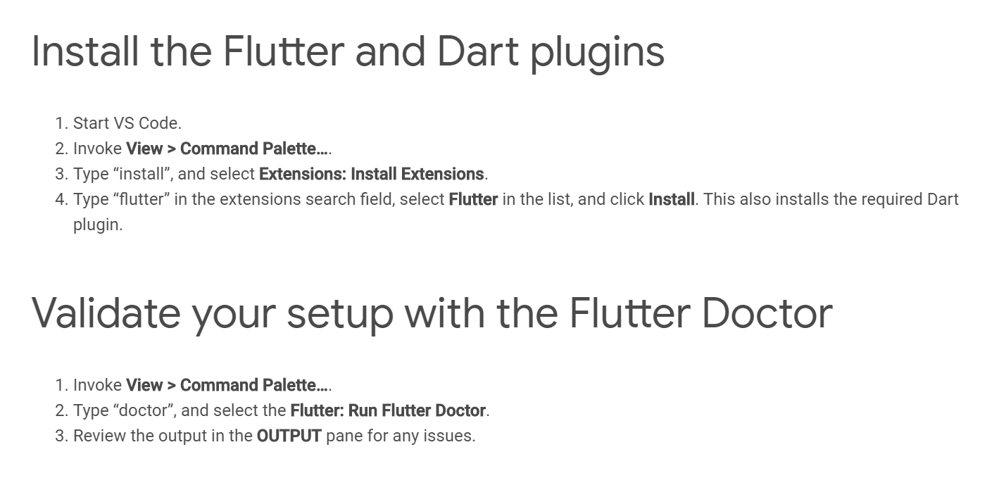
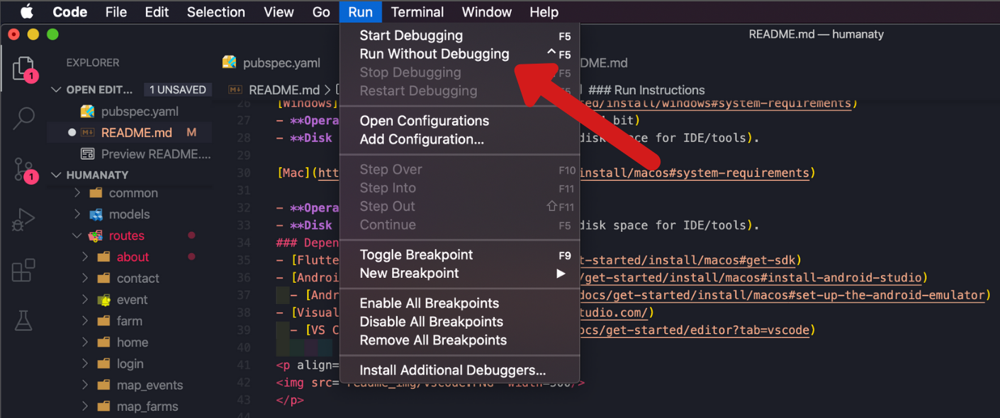
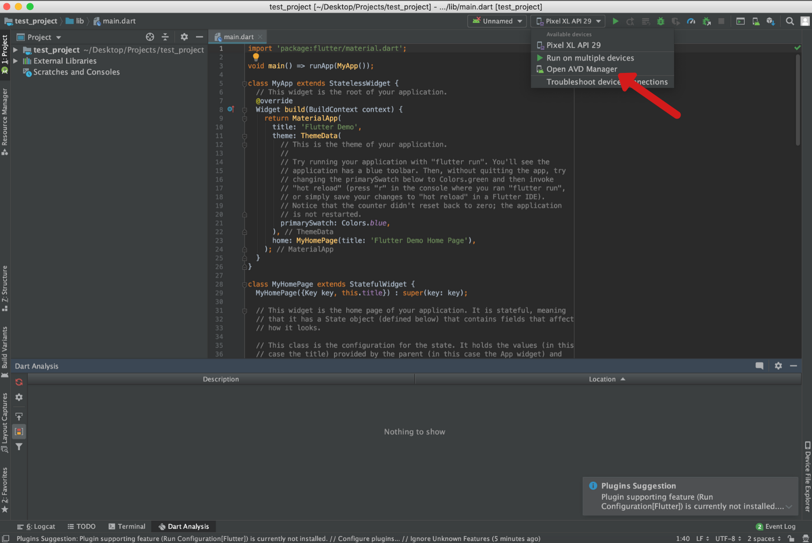
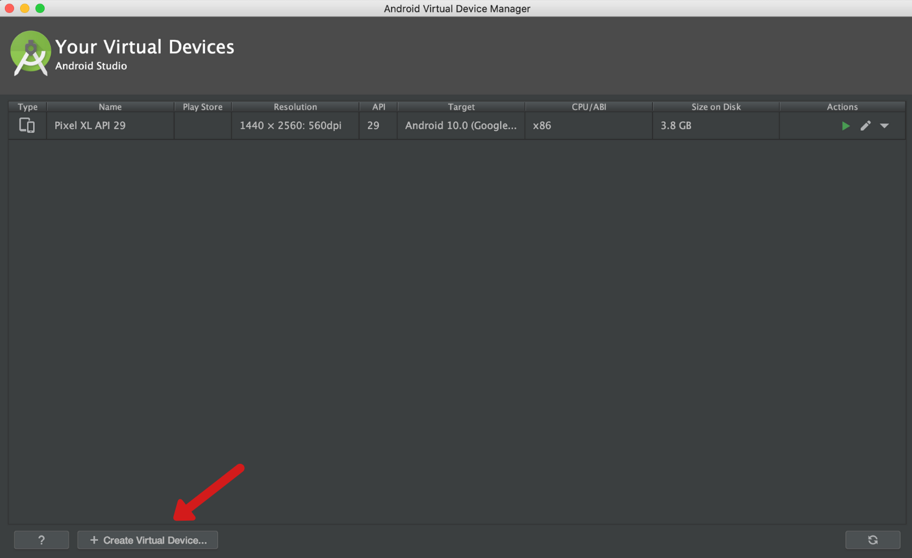
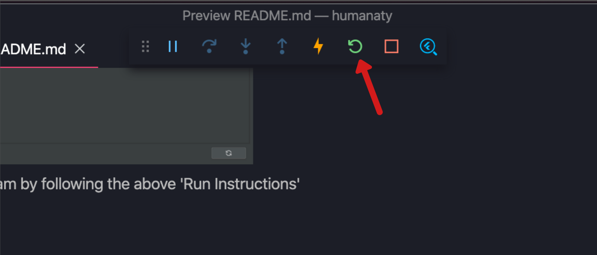

# huMANAty

## Release Notes
- New Software Features
    - Separate host and consumer modes
    - Users don't have to make another account for host
    - Users can set a profile picture on their account
    - Host can view events from calendar page
    - Host can edit event description and menu
    - Host can find farms via the farm map
    - Consumer can find events through the event map
    - Consumer can register for events

- Bug Fixes
    - App crash when host creates an event
    - App crash for consumers when viewing a glitched event

- Known Bugs and Defects
    - Host cannot delete event
    - My Events page not working for consumers
    - Host currently unable to set allergies for an event
    - Event date filter doesn't work

## Install Guide
### Pre-requisites
[Windows](https://flutter.dev/docs/get-started/install/windows#system-requirements)
- **Operating System:**  Windows 7 or later (64 bit)
- **Disk Space:** 400 MB (does not include disk space for IDE/tools).

[Mac](https://flutter.dev/docs/get-started/install/macos#system-requirements)

- **Operating Systems:** macOS (64-bit)
- **Disk Space:** 2.8 GB (does not include disk space for IDE/tools).
### Dependecies
- [Flutter SDK](https://flutter.dev/docs/get-started/install/macos#get-sdk)
- [Android Studio](https://flutter.dev/docs/get-started/install/macos#install-android-studio)
  - [Android Emulator](https://flutter.dev/docs/get-started/install/macos#set-up-the-android-emulator)
- [Visual Studio Code](https://code.visualstudio.com/)
  - [VS Code Plugins](https://flutter.dev/docs/get-started/editor?tab=vscode)
        

      

### Download Instructions
Navigate to [Github](https://github.com/bspencer30/humanaty) and download ZIP

Double click on the downloaded ZIP and extract entire 'humanaty-master' folder to a location of your choice. We recommend the desktop for ease of navigation in further steps.
### Build Instructions
After downloading the dependecies you are ready to build the application. Start Visual Studio Code and click 'File' -> 'Open Folder'. Open the unzipped directory 'humanaty-master'. 

### Run Instructions
Once you have the project open in Visual Studio Code, you can run the code by hitting the run tab and clicking "run without debugging"
 

 
A dropdown will appear and ask which device you would like to run the program on. If you have an android device connected to your computer, it should appear among these options. If no options are available, then you will have to use 'Android Studio' to download a virtual device to run the program on.

**Instructions to download virtual device:**
- Open 'Android Studio'
- Open the humanaty project in it or any project just to get to this screen shown below
 

 
- Once there, hit the 'Open AVD Manager' button
- Then hit the 'Create Virtual Device' button and follow the next steps
 

 
- After this you should be able to run the program by following the above 'Run Instructions'

### Troubleshooting
In general to avoid problems, when the application first loads, hit the refresh button in VS code to make sure it is using the most updated state that the code is in.
There is a control panel that appears in the middle top of VS code where you can stop the program or refresh the program.
Hit the refresh button as shown in the image below and then debug/use the application as desired.
 

